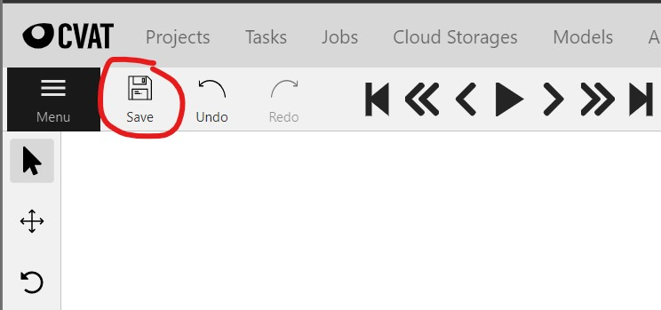

# Data Annotation Best Practices

1. How big do people have to be to require annotating?

All people should be annotated.
However, `ignore regions` may be defined for regions of the image where people are too small.
`Ignore regions/zones` are common to have depending on your footage use case.

For example, in the image below, the red region can be described as our `ignore region`.
This region will be excluded from annotations.
In the case that ships pass by in the water with passengers on deck, 
then we do not want them counted towards our data annotations.

2. How precise should annotations be?

Annotations may be made with very tight bounding boxes, 
with 1-5% margin, 
or with >5% margin of boundaries.

Option 1: Below is a very tight bounding box with little to no margin of error:

Option 2: Below is a looser bounding box with a 1-5% margin of error:

Option 3: Below is the loosest bounding box with a >5% margin of error:

For the purposes of this workshop, Option 2 is suitable for our use case.
Please utilize Option 2 for reference when performing your data annotations.

3. What is the `Identity` attribute?

| Annotation       | Annotation Type                             | Encoded by                                                                                                                                                                                                             |
|------------------|---------------------------------------------|------------------------------------------------------------------------------------------------------------------------------------------------------------------------------------------------------------------------|
| Identity         | Number                                      | Number indicating the person's identify (maintained over time). |

`Identity` is not personally identifiable information in the way one might initially think.
It does **not** mean name, DOB, address, etc.
`Identity` in this sense refers to a means to track the same person across different frames.

`CVAT` creates automatic `IDs` which cannot be changed.
For example, the image below has the automatic `ID` of `PERSON 3`.
However, we refer to the person with the `Identity` label of `1`.
This is the `Identity` with which we will refer to this person throughout the duration of the video.
For these purposes, you may disregard the automatic `IDs` given to each of your annotations.
In other words, please disregard the numbers by the red `X` in the image.

4. How to annotate partial people?

For cases where people are present only partially in the frame, annotate the parts of the person that you can.
Be sure to mark the `Occlusion` field accordingly.

5. How to annotate people who left the frame?
For cases where someone walked to where they are no longer visible,
mark the person as outside the frame by clicking on the `Switch Outside Property` field circled in the image below.

In the example above, the person who was being tracked by `Identity = 1` has now walked outside the frame.
By switching the `Outside Property` circled under the `Objects` tab on the right,
CVAT understands that the person is no longer visible within the frame.
This field will ensure that the data annotations properly account for people as they walk outside the frame.

6. If annotating every 10 frames, then how to account for the frame count not being evenly divisible by 10?

The workshop footage contains `1092` frames.
Being that it is a video and people are being tracked, then it is acceptable to annotate every 10 frames.
This is because CVAT knows to interpolate the frames between that are unannotated to automatically annotate them for us.
If annotating every 10 frames, you will end up on frame `1090`.
Go ahead and annotate the last frame numbered `1092`.

7. When to save annotation progress?

Click `Save` after each frame has been annotated.

