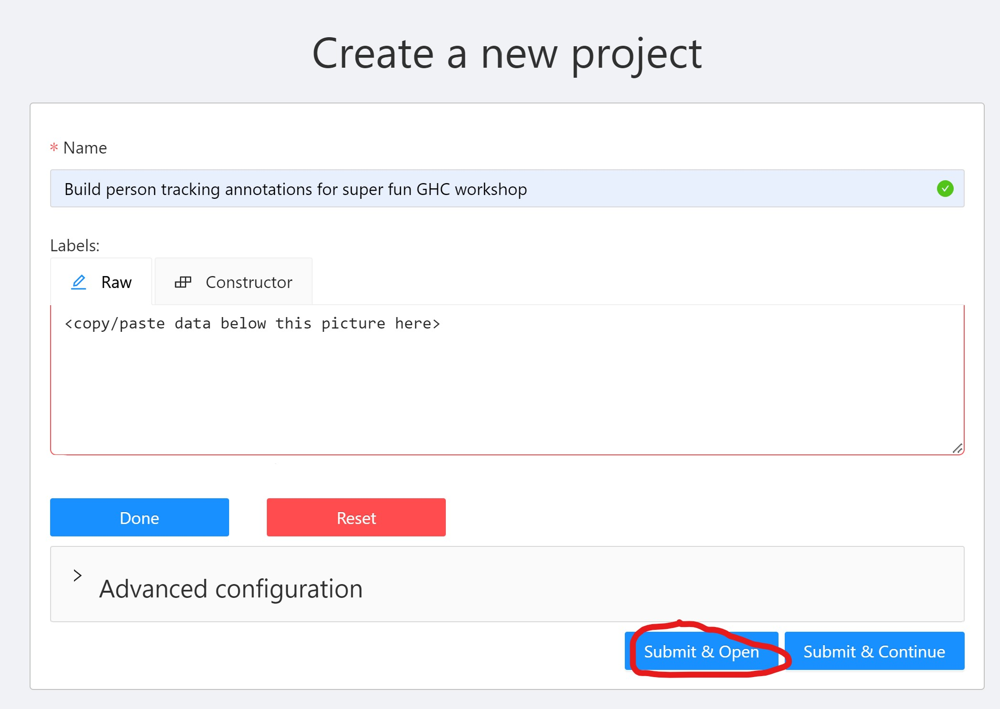
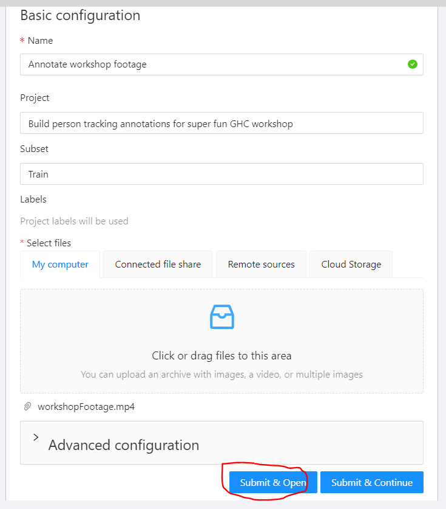
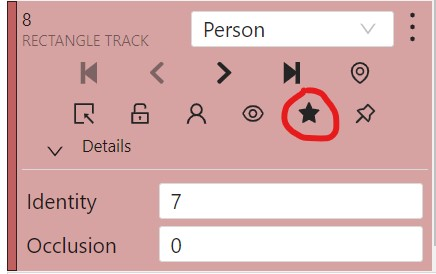

# Workshop Annotation Steps

# Overview
1. [Background Information](#background-information)
2. [Create Annotation Project](#steps-to-follow-to-create-an-annotation-project)
3. [Perform Annotations](#steps-to-follow-to-perform-data-annotations)
4. [Save Annotations](#steps-to-follow-once-frames-have-been-annotated)

## Background information
CVAT projects have a hierarchy incorporating tasks and jobs.
Annotation projects may have many annotation tasks and jobs.
Tasks are where you upload video footage and specify the associated project and labels.
Tasks represent the progress for annotation footage and details of the task.
They also allow you to upload existing annotations and export annotations.
Tasks may have multiple jobs.
Jobs allow you to split up tasks by frame to divvy up the annotations among a team.


## Steps to follow to create an annotation project
1. Create an account and login at [cvat.org](https://app.cvat.ai/).


> While creating a new account, a valid email address is required. Tool requires email confirmation by clicking on the link sent to this email address


2. Use the top navigation bar to click `Projects`.
    
3. Click the blue `+` sign to create a new project.
    
4. Copy the details from the image below to fill out the project to be created. 
      For the raw label data, copy/paste the data snipped below the picture. These data represent the labels & their attributes.
      
   

    Raw Label data to copy/paste into the CVAT UI: 
```json
[
  {
    "name": "Person",
    "id": 1199059,
    "color": "#c06060",
    "attributes": [
      {
        "id": 1198651,
        "name": "Identity",
        "input_type": "number",
        "mutable": false,
        "values": [
          "1",
          "1000",
          "1"
        ]
      },
      {
        "id": 1198650,
        "name": "Occlusion",
        "input_type": "number",
        "mutable": false,
        "values": [
          "0",
          "2",
          "1"
        ]
      }
    ]
  }
]
```
> Note: For more information on the labels used for the workshop, please refer to the [Annotation Specifications Doc](./annotationSpecifications.md).

5. Click on your newly created project and click on the blue `+` sign at the bottom right of it to create a new `task` for it.
    
6. Create your task copying the details below and click submit on your task:
    
    > Note: The test footage may be found [here](./assets/video/workshopFootage.mp4).
      You will use this video file for your annotation sample data.
      It may take a few seconds-minutes to upload the video footage pending the network bandwidth.
7. Click on the `Projects` tab and select the project you created.
    
You should now see the `task` you just created.
If this `task` does not show up, then allow a bit more time for the video to upload. 
8. Click on the `Open` button next to your newly created `task`.
You should now see a `job` created by default for your `task`.
   
9. Under the `job` details, assign the `job` to your username as seen below.
   
10. Click on the `job #` that was created above.
    
This will take you to a screen where you can start data annotations.
This is where you will use the supporting documents to perform your data annotations.
Feel free to ask questions as needed during this time, and collaborate with those around you as you progress.
    

## Steps to follow to perform data annotations
1. Hover over the rectangle shape on the left navigation bar, and select `Track`.
    
> Note: We are annotating a video file.
> This means we will want to track people as they move across the frame throughout the video.
2. Place your cursor at the top left of the person and click.
This should create the start of your bounding box.
Now go to the bottom right of the person to complete your person bounding box,
and click when you have included the bottom-rightmost part of your person.
   
3. In the right most part of the CVAT UI, under the `Objects` tab, 
you will leave `Identity` as `1`, and `Occlusion` as `0` as this is the first person we are creating a bounding box around.
This person also has no occlusions impacting the bounding box.
    
4. Once you have completed annotations for one person, then move onto the next person in the frame. Track bar (marked in red below) can be used to scroll through the frames one after the other.
    
5. Repeat steps 1-3 for each person going left to right in the frame.
> Note: Since Person 2 is seated and we only see ~50% of their body, 
> we will mark their `Occlusion` field as 1.
> 
> Also make sure to increment the number in `Identity` field for each new person. Refer to the point 3 in [Annotation Best Practices](./annotationBestPractices.md) for more details on this `Identity` field
> 
> Remember to refer to the [Annotation Specifications](./annotationSpecifications.md) as needed to adjust your annotations based on occlusions.
    

When you are done annotating frame 0, it should look like the below picture.
    

6. Now that all people in the frame are annotated, click `Save` to save the current annotations.
   
7. Click on the double right arrow to increment the frame count by 10.
    
> Note: You will see that the initial bounding boxes are no longer properly placed.
> The bounding boxes size and placement will need to be adjusted since this is a different frame,
> and people have moved.
> Also, by annotating every 10 frames, we are leveraging CVAT's interpolation feature.
> The interpolation feature allows annotators to annotate key frames,
> and then the frames between them will be interpolated automatically.
> Each frame annotated is automatically denoted as a key frame with the star shown below.
> 

8. Adjust the bounding boxes for the frame so that they look similar to the picture below.
    
9. Continue steps 1-7 for every 10 frames of the video annotated each person in the frame.

## Steps to follow once frames have been annotated

The following steps are meant to demonstrate to workshop attendees that data annotations go beyond a one-person effort.
Data annotation efforts may be reviewed by other team members, and even exported upon completion.

1. Click `Tasks`.
    
2. Open the `Annotate workshop footage` task.
    
3. Update the `Job Stage` to `validation`.
   
> Note: This is an important step when participating in data annotations within a team environment.
> Updating the stage from `annotation` to `validation` signals to others that the current annotations are ready for others to review.
> Once they have been reviewed and adjusted as necessary, then the annotations may be marked `accepted`.
4. Click `Tasks` again.
    
5. Click on the three dots at the bottom right of the workshop task,
and select to `Export task dataset`.
    
6. Fill in the export details following the image below.
    
> Note: You will now see the annotations downloaded to a zip folder in the Downloads folder.
> The zip folder contains an annotations XML formatted file that encodes the annotated data. 
> Different formats may be selected pending the format needed to train the specified model of choice.
> More information may be found in the section on [Annotation Format](./annotationSpecifications.md#annotation-format).
> The file contains tags corresponding to the project pieces created for this workshop
> (ie `<task>`, `<labels>`, `<track>`, `<box>`). 
> Those tags correspond to the task, label, and track ID, bounding box of the people annotated, etc.
> This exported data is what would be used to train a model.
