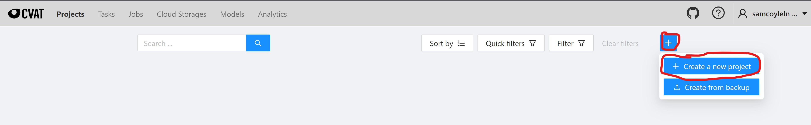

# Workshop Annotation Steps

## Background information
CVAT projects have a hierarchy incorporating tasks and jobs.
Annotation projects may have many annotation tasks and jobs.
Tasks are where you upload video footage and specify the associated project and labels.
Tasks represent the progress for annotation footage and details of the task.
They also allow you to upload existing annotations and export annotations.
Tasks may have multiple jobs.
Jobs allow you to split up tasks by frame to divvy up the annotations among a team.


## Steps to follow
1. Create an account and login at [cvat.org](https://cvat.org/auth/login).
    > Note: You may see a notification pop up that looks like the image below.
        Please disregard and close the note.
      
2. Use the top navigation bar to click `Projects`.
3. Click the blue `+` sign to create a new project.
      
4. Copy the details from the image below to fill out the project to be created. 
      For the raw label data, copy/paste the data snipped below the picture.
   

    Raw Label data to copy/paste into CVAT UI: 
```json
[
  {
    "name": "Person",
    "id": 1199059,
    "color": "#c06060",
    "attributes": [
      {
        "id": 1198651,
        "name": "Identity",
        "input_type": "number",
        "mutable": false,
        "values": [
          "1",
          "1000",
          "1"
        ]
      },
      {
        "id": 1198650,
        "name": "Occlusion",
        "input_type": "number",
        "mutable": false,
        "values": [
          "0",
          "2",
          "1"
        ]
      }
    ]
  },
  {
    "name": "Face",
    "id": 1205813,
    "color": "#90e8ce",
    "attributes": []
  }
]
```
> Note: For more information on the labels used for the workshop, please refer to the [Annotation Specifications Doc](./annotationSpecifications.md).

5. Click on your newly created project and click on the blue `+` sign at the bottom right of it to create a new `task` for it.
6. Create your tasks copying the details below and click submit on your task:
    
    > Note: The test footage may be found [here](./assets/video/workshopFootage.mp4).
      You will use this video file for your annotation sample data.
      It may take a few seconds-minutes to upload the video footage pending the network bandwidth.
7Click on the `Projects` tab and select the project you created.
7. You should now see the `task` you just created.
If this `task` does not show up, then allow a bit more time for the video to upload. 
8. Click on the `Open` button next to your newly created `task`.
You should now see a `job` created by default for your `task`.
9. Under the `job` details, assign the `job` to your username as seen below.
   
10. Click on the `job #` that was created above.
This will take you to a screen where you can start data annotations.
This is where you will use the supporting documents to perform your data annotations.
Feel free to ask questions as needed during this time, and collaborate with those around you as you progress.


#### TODO: Details on how to perform data annotations for person bounding boxes
#### TODO: Details on how to perform data annotations for person identity
#### TODO: Details on how to perform data annotations for person occlusions
#### TODO: Details on how to perform data annotations for face bounding boxes

#### TODO: Wrap up with how to export data annotations

